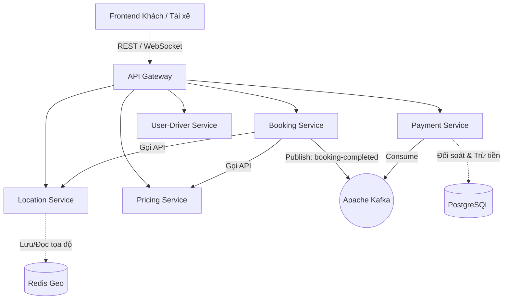

# Ride-Hailing & Logistics System

Hệ thống Ride-Hailing & Logistics theo kiến trúc Microservice

## Tổng quan

Hệ thống hỗ trợ đầy đủ quy trình vòng đời của một chuyến đi bao gồm: đặt xe, nhận cuốc, định giá động, thanh toán đa
kênh và giám sát vận hành. Nền tảng được xây dựng dựa trên kiến trúc Microservices sử dụng **Java Spring Boot**, **Redis** , **PostgreSQL**, **Kafka**, và **WebSocket**.

### Lý do bài toán mang tính thực tế

Nhu cầu vận chuyển và giao nhận đang bùng nổ, đòi hỏi các doanh nghiệp phải có một hệ thống lõi mạnh mẽ. Bài toán này
giải quyết các thách thức kỹ thuật thực tế tại các công ty công nghệ lớn:

- Xử lý hàng ngàn kết nối GPS đồng thời
- Tính toán định giá tự động theo thời gian thực (Surge Pricing)
- Đảm bảo tính nhất quán của dữ liệu giao dịch tài chính

## Kiến trúc hệ thống

Hệ thống được chia nhỏ thành các domain độc lập để đảm bảo khả năng mở rộng ngang và chịu tải cao.

### Danh sách các Services

| Service                 | Chức năng                                                                                                               |
|-------------------------|-------------------------------------------------------------------------------------------------------------------------|
| **API Gateway**         | Điểm vào chung cho toàn bộ hệ thống, chịu trách nhiệm xác thực JWT, chuyển header và kiểm soát truy cập                 |
| **Discovery Service**   | Sử dụng Eureka để đăng ký và tìm kiếm các service nội bộ                                                                |
| **User-Driver Service** | Quản lý thông tin khách hàng, tài xế, xử lý đăng nhập, quản lý token và trạng thái online/offline                       |
| **Booking Service**     | Xử lý lifecycle cuốc xe từ tạo booking đến nhận cuốc, cập nhật trạng thái và tự động luân chuyển tài xế (auto-reassign) |
| **Location Service**    | Lưu trữ và truy vấn vị trí tài xế theo thời gian thực thông qua Redis Geo và WebSocket                                  |
| **Pricing Service**     | Tính giá động (surge) dựa trên khoảng cách, thời gian, mức cầu/cung sử dụng H3 Grid                                     |
| **Payment Service**     | Quản lý ví, giao dịch, tích hợp thanh toán MoMo/VNPay, xử lý nạp/rút tiền và tính toán hoa hồng tự động                 |

### Sơ đồ luồng dữ liệu

### Cơ chế giao tiếp

- **REST API**: Giao tiếp nội bộ đồng bộ giữa các services (VD: Booking gọi Pricing để lấy giá) thông qua tên dịch vụ từ
  Eureka
- **WebSocket**: Giao tiếp hai chiều theo thời gian thực để nhận cập nhật vị trí và trạng thái chuyến đi liên tục
- **Event-Driven Queue (Kafka)**: Giao tiếp bất đồng bộ, sử dụng để phát các sự kiện như `booking-completed-topic` (để
  Payment thu hoa hồng) và `driver-registered-topic` (để tạo ví mới)

## 🔍 Hướng dẫn tìm hiểu & phân tích hệ thống

### Phân tích Domain Driven Design (DDD)

- **Core Domain**: Quản lý vòng đời cuốc xe (Booking) và Quản lý vị trí địa lý (Location)
- **Supporting Domain**: Thuật toán định giá động phân vùng theo ô lục giác H3 (Pricing)
- **Generic Domain**: Đăng ký/Xác thực (User-Driver) và Xử lý giao dịch tài chính (Payment)

### Xử lý dữ liệu & Database

- Hệ thống sử dụng cơ chế **Database-per-service** với PostgreSQL để đảm bảo tính độc lập
- Redis được sử dụng chuyên sâu để:
    - Chặn spam (chặn đặt cuốc trong 5 giây)
    - Dùng Redis Lock để giữ chỗ tài xế tạm thời trong 20 giây
    - Truy vấn bán kính (3km, 5km, 8km)

### API Contract

API Gateway đóng vai trò màng lọc xác thực, chuyển các thông tin quan trọng qua header như `X-User-Id`, `X-User-Role`
xuống các service phía sau.

## Hướng dẫn triển khai lên VPS thực tế

Quá trình đưa hệ thống từ môi trường Dev lên Production (Staging) được tự động hóa hoàn toàn.

### Chuẩn bị Server

Triển khai trên môi trường VPS Ubuntu với domain VD: `ridehailingsystem.online`.

### Containerization

Đóng gói ứng dụng Java, PostgreSQL, Redis, Kafka bằng **Docker** và vận hành qua **Docker Compose**.

### CI/CD Pipeline

Tích hợp **GitHub Actions** để tự động:

1. Build code
2. Chạy test
3. Push Docker image lên Docker Hub
4. Deploy tự động lên server staging khi có commit vào nhánh `main`

### Monitoring & Observability

- Giám sát hiệu năng hệ thống bằng **Prometheus** và hiển thị qua dashboard **Grafana**
- Quản lý Log tập trung bằng cách dùng **Fluentd** để thu thập log, gửi đến **Elasticsearch** và trực quan hóa qua **Kibana**

## Tiêu chí đánh giá & Yêu cầu bài làm

### Chỉ số đo lường sản phẩm

- Khả năng chịu tải khi xử lý nhiều booking đồng thời mà không bị Race Condition nhờ Redis Lock
- Thời gian phản hồi cập nhật tọa độ GPS qua WebSocket đạt độ trễ thấp
- Giá cước cập nhật chính xác theo mức surge (`NORMAL`, `LIGHT`, `MODERATE`, `SEVERE`) dựa trên tỷ lệ Cung-Cầu

### Kịch bản Demo bắt buộc

#### DEMO:
- Deploy trên server staging: https://ridehailingsystem.online
- Demo khách hàng: https://ridehailingsystem.online/customer-app.html (sử dụng số điện thoại 0987658652 và mật khẩu 123456 để đăng nhập)
- Demo tài xế: https://ridehailingsystem.online/driver-app.html (sủ dụng số điện thoại 0999999999 và mật khẩu 123456 để đăng nhập)

**1. Demo Đặt xe & Định giá động**
Khách hàng đăng nhập tạo booking; hệ thống kiểm tra spam, gọi Pricing Service để tính giá, và hiển
thị mức giá cuối cùng.

**2. Demo Tìm kiếm & Giao cuốc (Match-making)**
Hệ thống quét Redis Geo tìm tài xế gần nhất; dùng Redis Lock giữ chỗ 20 giây. Nếu tài xế từ chối
hoặc hết giờ, đưa vào danh sách đen của cuốc và tự động mời tài xế khác.

**3. Demo Giao dịch & Phạt ngầm**
Tài xế hoàn thành chuyến, Kafka kích hoạt Payment Service thu hoa hồng. Trình diễn tự động ép tài xế offline nếu số dư
ví âm quá 50.000 VND.

**4. Demo Thanh toán & IPN**
Khách hàng thanh toán qua MoMo/VNPay. Hệ thống nhận callback IPN, cập nhật ví và tự động hủy các giao dịch pending nếu
quá 15 phút.

## 🛠️ Công nghệ sử dụng

- **Backend**: Java, Spring Boot
- **Database**: PostgreSQL (Database-per-service)
- **Cache & Lock**: Redis (Redis Geo, Redis Lock)
- **Message Queue**: Apache Kafka
- **Service Discovery**: Eureka
- **Real-time**: WebSocket
- **Geo Indexing**: H3 Grid
- **Thanh toán**: MoMo, VNPay
- **Containerization**: Docker, Docker Compose
- **CI/CD**: GitHub Actions
- **Monitoring**: Prometheus, Grafana
- **Logging**: Fluentd, Elasticsearch, Kibana